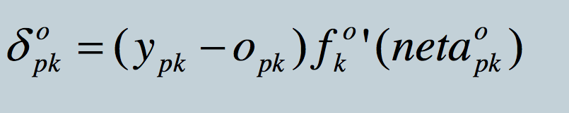

# Clase 4 - Backpropagation

Tiene más de una neurona en la capa oculta.

+ Sirve para problemas no linearmente separable.
+ Una recta por cada neurona.

## Ejemplo:

| I | II | III | clase |
|---|----|-----|-------|
| 0 | 0  | 0   | C     |
| 0 | 0  | 1   | C     |
| 0 | 1  | 0   | A     |
| 0 | 1  | 1   | X     |
| 1 | 0  | 0   | B     |
| 1 | 0  | 1   | D     |
| 1 | 1  | 0   | A     |
| 1 | 1  | 1   | A     |

+ Enfoque más usado es una neurona por clase, cada neurona se enciende por cada clase.
+ Si más de una neurona se prende para múltiples salidas
+ Entrada es una por variable.

## Fórmula para backpropagation:

El gradiente ayuda a descender para alcanzar el valor mínimo.

Todo esto es para la matriz de pesos de la capa de salida.

