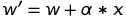

# Clase 02 - Perceptrón

Los W son valores reales, se necesitan un valor inicial.

+ Dependiendo del W inicial los valores pueden variar.

+ Lo que sucede en la neurona se conoce como función de transferencia.

## Entrenamiento

+ W al azar

+ Proceso iterativo

+ El /alpha representa el learning rate w' = w + /alpha x

+ /alpha entre 0 y 1 por lo general.

+ w_nuevo = w + /alpha * (t-y) * x

&space;*&space;x" target="_blank"></a>)

## Hoy

No se usa porque tienen que ser linealmente separables.

## bias

Para saber el valor de /theta usado se despeja la ecuación, se transforma en w3 * 1, y esa w3 pasa a ser b quedando como -b.